# Gradious Service Ticket System

A production-oriented **IT Service Desk and Ticket Management Platform** designed to manage software installation, update, uninstallation, licensing, and technical support requests across multiple centers and labs.

The system implements role-based access control, ticket lifecycle management, technician assignment, SLA monitoring, public and internal communication, notifications, audit history, realtime updates, idempotent ticket creation, and administrative analytics.

---

## 📌 Overview

The Gradious Service Ticket System models a real-world internal IT service desk.

Employees can raise service requests and track their progress, while technicians, center managers, and administrators manage tickets according to their responsibilities.

The application is built around explicit business rules and controlled ticket lifecycle transitions rather than simple CRUD operations.

### Core workflow

```text
Employee
   │
   │ Create Service Request
   ▼
┌─────────────┐
│    OPEN     │
└──────┬──────┘
       │
       ▼
┌─────────────┐
│   TRIAGED   │
└──────┬──────┘
       │
       ▼
┌─────────────┐
│  ASSIGNED   │
└──────┬──────┘
       │
       ▼
┌─────────────┐
│ IN_PROGRESS │◄──────────────┐
└──────┬──────┘               │
       │                      │
       │ Request Information  │
       ▼                      │
┌──────────────────┐          │
│ WAITING_FOR_USER │──────────┘
└──────────────────┘
       │
       ▼
┌─────────────┐
│  RESOLVED   │
└──────┬──────┘
       │
       ▼
┌─────────────┐
│    CLOSED   │
└─────────────┘
```

The system also supports controlled cancellation and reopening workflows.

---

# ✨ Features

## 👤 Role-Based Access Control

The platform supports four roles:

| Role | Responsibilities |
|---|---|
| **Employee** | Create tickets, view own tickets, respond to information requests, confirm closure |
| **Technician** | Manage assigned tickets, communicate with requesters, request information, resolve tickets |
| **Center Manager** | Manage center tickets, assign technicians, communicate with service teams, manage cancellation workflows |
| **Admin** | Global ticket management, assignments, administration, SLA monitoring, and analytics |

Authorization is enforced on the backend through role and resource-level policies.

---

## 🎫 Ticket Management

Employees can create IT service requests containing:

- Request type
- Software
- Category
- Center
- Lab
- Priority
- Description
- Business justification
- Additional request information

Supported request types:

- Installation
- Update
- Uninstallation
- License

---

## 🔄 Ticket Lifecycle

Supported ticket states:

```text
OPEN
TRIAGED
ASSIGNED
IN_PROGRESS
WAITING_FOR_USER
RESOLVED
CLOSED
CANCELLED
```

The backend validates lifecycle transitions and prevents unauthorized or invalid state changes.

Supported workflows include:

- Ticket creation
- Ticket triage
- Technician assignment
- Starting work
- Requesting additional information
- Employee response
- Resolution
- Employee closure confirmation
- Reopening
- Cancellation
- Cancellation requests

---

# 💬 Ticket Communication

The system provides a dedicated conversation system for ticket collaboration.

### Public comments

Public comments can be viewed by authorized participants in the ticket conversation.

They are used for communication between employees and the service desk.

### Internal notes

Internal notes are restricted to authorized staff:

- Technician
- Center Manager
- Admin

Employees cannot retrieve internal comments through the backend API.

The backend applies visibility filtering before returning ticket comments.

---

# 📝 Request Information Workflow

When a technician requires additional information, the **Request Information** workflow allows the technician to provide a specific explanation to the requester.

The operation atomically:

1. Creates a public comment.
2. Changes the ticket to `WAITING_FOR_USER`.
3. Pauses the active SLA cycle.
4. Creates ticket history.
5. Creates an audit record.
6. Creates a notification for the requester.

This ensures that the comment and ticket state cannot become inconsistent.

```text
Technician
     │
     │ Request Information
     ▼
Public Comment
     │
     ├── Ticket → WAITING_FOR_USER
     ├── SLA → Paused
     ├── History → Recorded
     ├── Audit → Recorded
     └── Notification → Requester
```

---

# ⏱️ SLA Management

The system supports SLA-driven ticket processing.

SLA capabilities include:

- First response targets
- Resolution targets
- At-risk thresholds
- SLA cycles
- SLA pause/resume
- First response tracking
- Resolution tracking
- SLA compliance monitoring
- SLA alerts

A background scheduler periodically evaluates active tickets for SLA conditions.

The scheduler prevents overlapping scans so that a slow scan does not result in concurrent duplicate processing.

---

# 🔔 Notifications

Notifications are generated for important ticket events such as:

- Ticket creation
- Assignment
- Status changes
- Additional information requests
- Comments
- Resolution
- Cancellation
- SLA alerts

Notifications are persisted and relevant events can also be delivered through the realtime communication layer.

---

# ⚡ Realtime Updates

The application uses Socket.IO for realtime ticket and notification updates.

Example events include:

```text
ticket:status_changed
ticket:comment_created
notification:created
```

REST APIs remain responsible for persisted application state, while realtime events provide immediate UI updates.

---

# 📊 Administrative Analytics

The administrative analytics system provides operational visibility into:

- Ticket volume
- Ticket trends
- Tickets by center
- Tickets by category
- Tickets by priority
- SLA compliance
- Average resolution time
- First response time
- Technician workload
- Resolution rate

The analytics layer is intended to support service desk monitoring and operational decision-making.

---

# 🔐 Security

Security and authorization considerations include:

- JWT-based authentication
- bcrypt password hashing
- Role-based authorization
- Resource-level authorization
- Backend lifecycle policies
- Zod request validation
- Public/internal comment isolation
- Audit logging
- Idempotent ticket creation
- Protected administrative operations
- Express security hardening

The frontend is treated as a user interface layer, while the backend remains the final authorization boundary.

---

# 🧱 Architecture

The backend follows a modular domain-oriented architecture.

```text
backend/
└── src/
    ├── common/
    ├── config/
    ├── generated/
    ├── middleware/
    ├── modules/
    │   ├── auth/
    │   ├── users/
    │   ├── centers/
    │   ├── labs/
    │   ├── catalog/
    │   ├── tickets/
    │   ├── comments/
    │   ├── notifications/
    │   ├── audit/
    │   └── ...
    ├── socket/
    ├── app.ts
    └── server.ts
```

The application separates:

- Controllers
- Use cases
- Policies
- Validation schemas
- Services
- Database access
- Notification handling
- Realtime communication

This keeps business rules out of route handlers and makes the system easier to maintain.

---

# 🗄️ Database

The application uses **MySQL/MariaDB with Prisma ORM**.

Major domain entities include:

- User
- Center
- UserCenter
- Lab
- Category
- Software
- Ticket
- Comment
- TicketHistory
- AssignmentHistory
- Notification
- AuditLog
- TicketNumberCounter
- TicketSlaCycle
- NotificationPreference
- Holiday
- IdempotencyRecord

The database design supports ticket lifecycle history, SLA tracking, auditability, assignment workflows, notifications, and operational consistency.

---

# 🔒 Transaction & Consistency Design

Critical ticket operations use database transactions.

Ticket creation coordinates:

```text
Idempotency Reservation
        ↓
Ticket Number Allocation
        ↓
Ticket Creation
        ↓
Ticket History
        ↓
SLA Cycle
        ↓
Audit Log
        ↓
Idempotency Response
```

If a critical operation fails, the transaction rolls back rather than leaving partially-created ticket state.

Ticket numbers are allocated atomically through the ticket number counter to prevent duplicate ticket numbers during concurrent requests.

---

# ♻️ Idempotency

Ticket creation supports idempotency to protect against duplicate submissions caused by:

- Network retries
- Browser retries
- Duplicate client submissions
- Request replay
- Client-side timeouts

A repeated request with the same idempotency key can safely return the existing operation result instead of creating another ticket.

---

# 🧪 Validation & Error Handling

The API uses Zod schemas for request validation.

The backend also uses centralized error handling for:

- Validation errors
- Authentication failures
- Authorization failures
- Missing resources
- Business-rule conflicts
- Database errors

Common API error categories include:

```text
400 VALIDATION_ERROR
401 UNAUTHENTICATED
403 FORBIDDEN
404 NOT_FOUND
409 CONFLICT
```

---

# 🖥️ Application Screenshots

The following screenshots demonstrate the main application workflows and role-based experiences.

---

## 🔐 Authentication

### Login

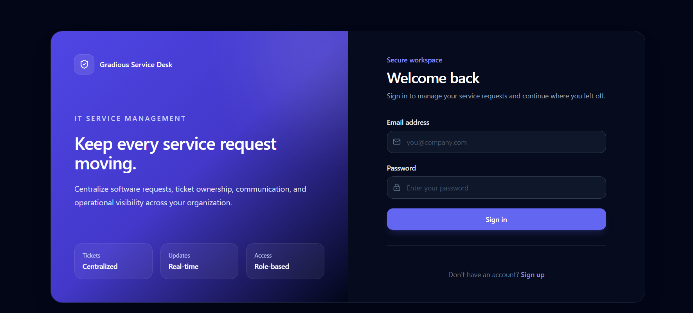

### Registration

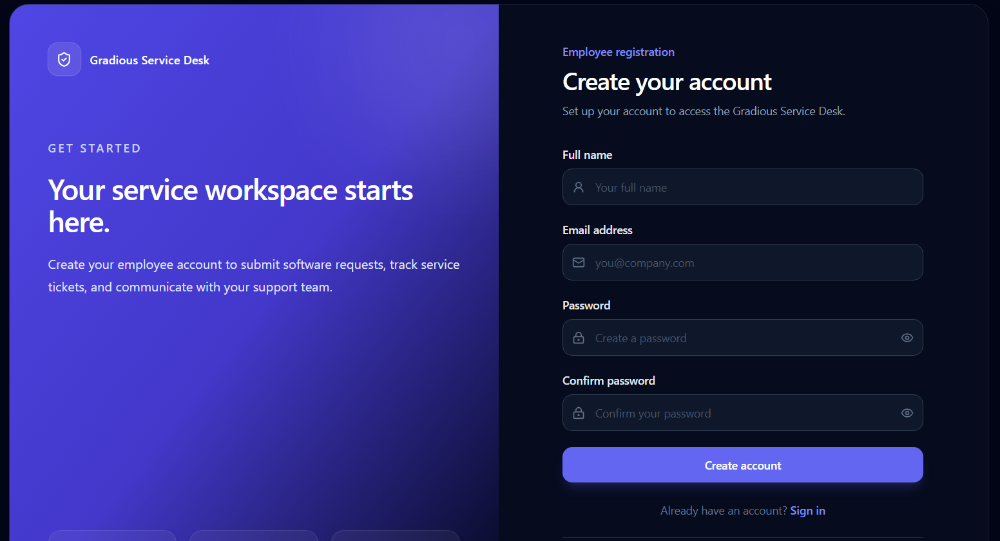

---

# 👤 Employee Experience

## Employee Dashboard

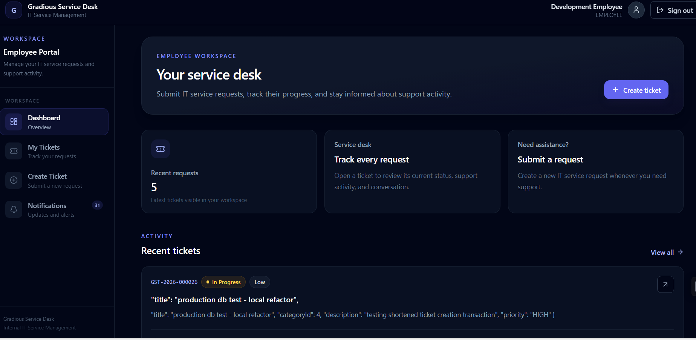

The employee dashboard provides an overview of submitted service requests and their current state.

---

## Ticket Creation

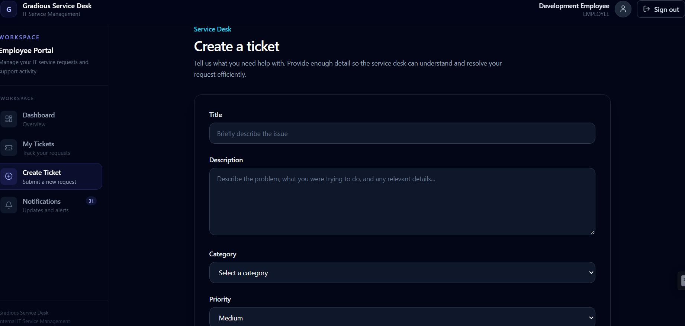

Employees can create service requests by specifying the required software/service information, request type, priority, center, lab, and description.

---

## Ticket Details

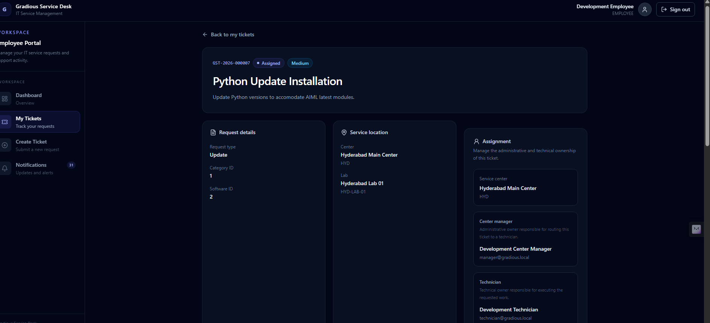

The ticket details view provides the employee with ticket information, lifecycle state, assignment information, SLA information, history, and available actions.

---

## Ticket Conversation

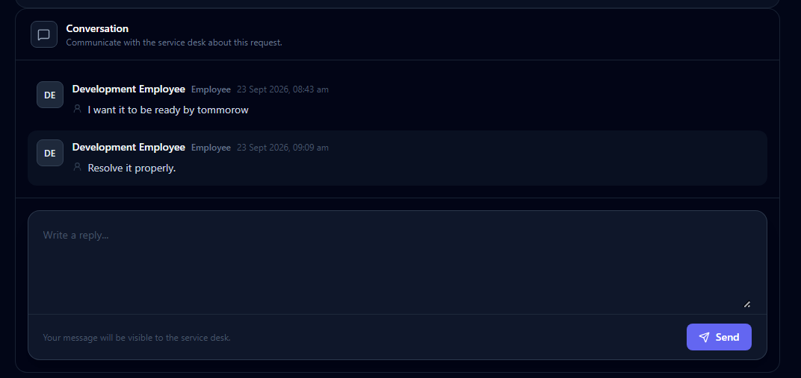

The conversation interface allows authorized participants to communicate about a ticket.

Public communication is visible to the requester and authorized service personnel.

---

# 🧑‍💻 Technician Experience

## Technician Dashboard

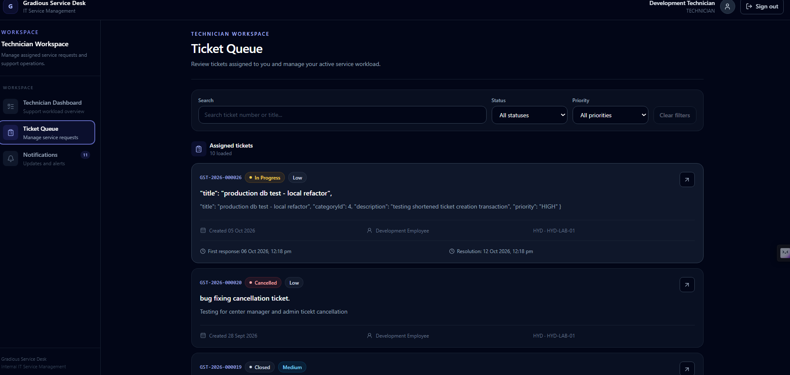

The technician dashboard provides visibility into assigned work, ticket priorities, statuses, and operational actions.

---

## Request Information

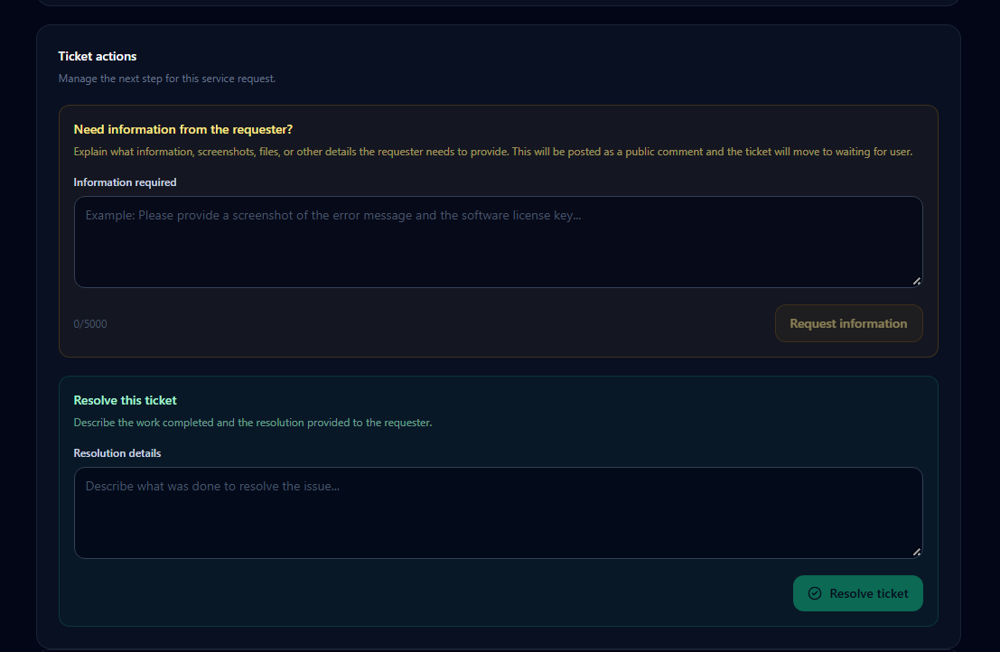

Technicians can request additional information from employees while providing a clear explanation of what information is required.

The request simultaneously updates the ticket lifecycle and SLA state.

---

# 🏢 Center Manager Experience

## Center Manager Dashboard

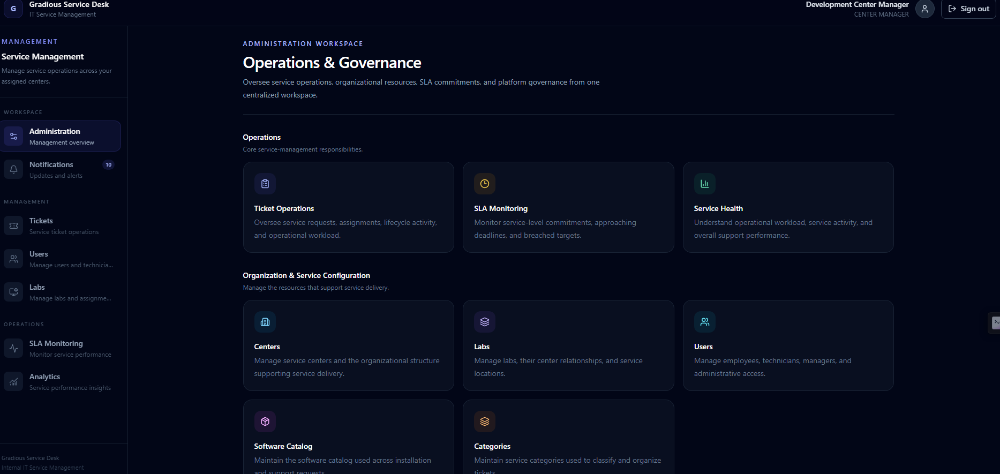

The center manager dashboard provides center-scoped ticket management and operational visibility.

Managers can work with tickets within their authorized centers and participate in service desk communication.

---

# 👑 Administration

## Admin Dashboard

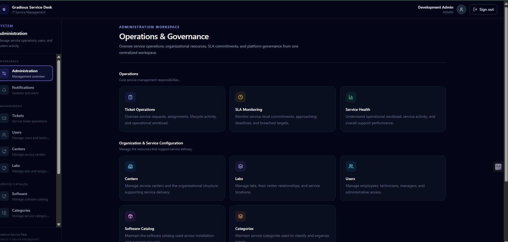

The admin dashboard provides global visibility and management capabilities across the service desk.

---

## SLA Monitoring

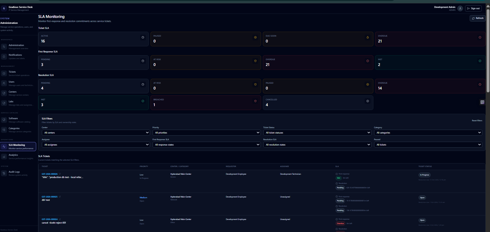

The SLA monitoring interface provides visibility into tickets approaching or exceeding configured SLA thresholds.

---

## Analytics

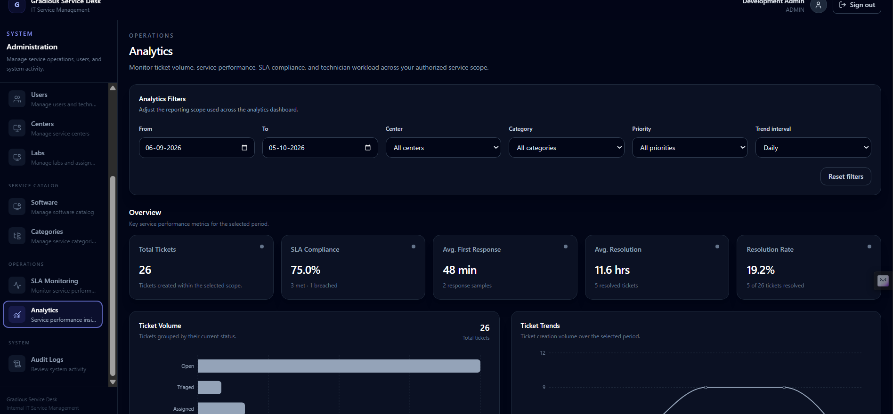

The analytics dashboard provides service desk metrics including ticket distribution, trends, SLA performance, and operational workload.

---

## Additional Analytics View

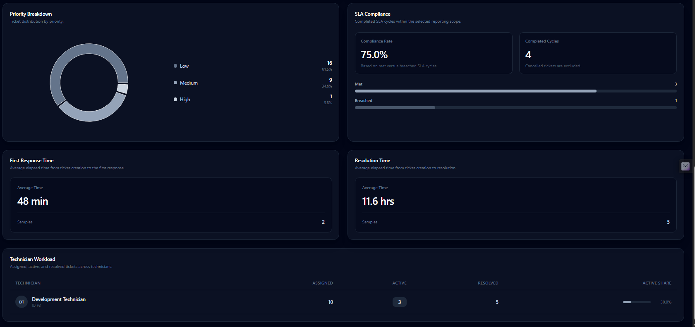

Additional analytical visualization for operational ticket data.

---

# 🛠️ Technology Stack

## Frontend

- React
- TypeScript
- Vite
- React Router
- TanStack Query
- React Hook Form
- Zod
- Tailwind CSS
- Lucide React
- Socket.IO Client

## Backend

- Node.js
- Express
- TypeScript
- Prisma ORM
- MySQL/MariaDB
- Zod
- JWT
- bcrypt
- Socket.IO

## Infrastructure

- Git
- GitHub
- Render
- Clever Cloud MySQL/MariaDB

---

# 📁 Repository Structure

```text
gradious-service-ticket-system/
│
├── backend/
│   ├── prisma/
│   ├── src/
│   ├── package.json
│   ├── tsconfig.json
│   └── ...
│
├── frontend/
│   ├── src/
│   ├── public/
│   ├── package.json
│   └── ...
│
├── docs/
│   └── screenshots/
│       ├── admin_analytics.png
│       ├── admin_dashboard.png
│       ├── admin_sla_monitoring.png
│       ├── analytics_3.png
│       ├── employee_dashboard.png
│       ├── login.png
│       ├── manager_dashboard.png
│       ├── register.png
│       ├── request-information.png
│       ├── technician_dashboard.png
│       ├── ticket_comments.png
│       ├── ticket_creation.png
│       └── ticket_details.png
│
└── README.md
```

---

# 🚀 Local Development

## Prerequisites

Install:

- Node.js 22+
- npm
- MySQL/MariaDB
- Git

---

## Backend

```bash
cd backend
npm install
```

Configure the required environment variables in:

```text
.env
```

Generate the Prisma client:

```bash
npx prisma generate
```

Start the backend:

```bash
npm run dev
```

The backend runs on:

```text
http://localhost:5000
```

Health endpoint:

```text
GET /api/v1/health
```

---

## Frontend

```bash
cd frontend
npm install
npm run dev
```

The Vite development server will provide the local frontend URL.

---

# 🌐 Production Deployment

The application is designed to run as a separate frontend/backend deployment with a managed MySQL/MariaDB database.

```text
┌──────────────────┐
│     Frontend     │
│      React       │
└────────┬─────────┘
         │
         │ REST / Socket.IO
         ▼
┌──────────────────┐
│      Backend     │
│ Node + Express   │
└────────┬─────────┘
         │
         │ Prisma
         ▼
┌──────────────────┐
│  MySQL/MariaDB   │
└──────────────────┘
```

### Production URLs

Frontend:

`[ ADD PRODUCTION FRONTEND URL HERE ]`

Backend:

`[ ADD PRODUCTION BACKEND URL HERE ]`

API Health Check:

`[ ADD PRODUCTION HEALTH URL HERE ]`

---

# 🔑 Environment Variables

Sensitive configuration is not committed to the repository.

The backend requires environment-specific configuration such as:

```text
DATABASE_URL
JWT_SECRET
JWT_EXPIRES_IN
CORS_ORIGIN
PORT
```

Production secrets should be configured through the deployment platform rather than committed to Git.

---

# 📐 Engineering Decisions

## Backend Authorization

Frontend permission checks are used to control the user experience, but backend authorization remains authoritative.

This prevents users from bypassing security simply by modifying frontend requests.

---

## Atomic Lifecycle Operations

Important lifecycle operations coordinate related database changes inside transactions.

For example, requesting information updates:

```text
Comment
Ticket Status
SLA Cycle
Ticket History
Audit Log
Notification
```

as one logical operation.

---

## Public vs Internal Communication

Public communication is intended for requester/service-desk collaboration.

Internal notes are restricted to authorized staff and are filtered at the backend.

---

## SLA Cycles

SLA state is represented separately from ticket status so that SLA timers can be paused and resumed during states such as `WAITING_FOR_USER`.

---

## Auditability

Important ticket operations generate audit information and lifecycle history, providing a traceable record of changes.

---

## Realtime Communication

REST APIs remain the source of persisted application state, while Socket.IO provides realtime delivery of important events.

---

## User-Scoped Client Caching

Ticket comment queries are scoped by the authenticated user's identity and role.

This prevents a cached comment response from one account from being reused by another account when users switch sessions in the same browser.

Backend visibility filtering remains the primary security boundary.

---

# ⚙️ Production Considerations

The project includes several production-oriented considerations:

- Role-based authorization
- Resource-level access control
- Transactional lifecycle operations
- Idempotent ticket creation
- Atomic ticket number generation
- SLA monitoring
- Audit logging
- Centralized error handling
- Input validation
- Realtime updates
- Notification deduplication
- User-scoped client caching
- Express proxy configuration
- Disabled Express `x-powered-by` header
- Transaction timeout handling for managed database environments

---

# 🧹 Operational Logging

Application logs are retained for operational observability and troubleshooting.

Expected/idempotent database conditions are handled by the application rather than being treated as fatal failures.

Temporary development/debug logging should not be committed to production.

Sensitive credentials, tokens, passwords, and other secrets are never intentionally logged.

---

# 🧭 Project Status

**Status: Completed**

The project includes:

- Authentication
- Role-based authorization
- Employee registration
- Ticket creation
- Ticket lifecycle management
- Center management
- Lab management
- Software/catalog management
- Technician assignment
- Center manager assignment
- Public comments
- Internal staff notes
- Request information workflow
- SLA tracking
- SLA monitoring
- Notifications
- Realtime updates
- Audit history
- Idempotent ticket creation
- Administrative analytics
- Production deployment configuration
- Responsive application UI

---

# 👨‍💻 Author

**Sriniketh Vangipuram**

Full Stack Developer

### Core Technologies

`React` · `TypeScript` · `Node.js` · `Express` · `Prisma` · `MySQL` · `MongoDB` · `REST APIs` · `JWT` · `Socket.IO`

---

# 📜 License

This project was developed as part of the Gradious training/project assignment.

All rights reserved.